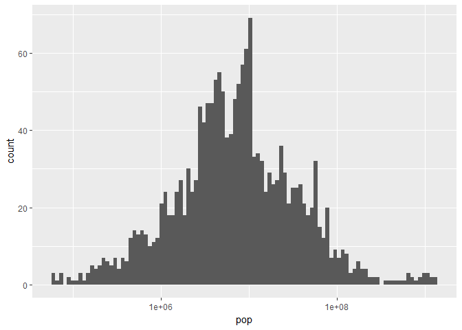
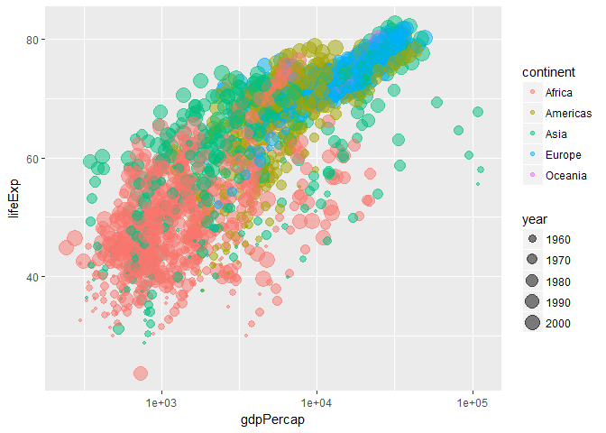
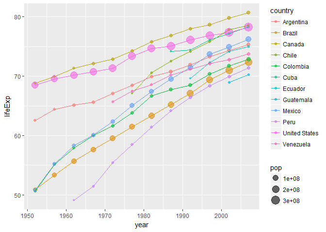
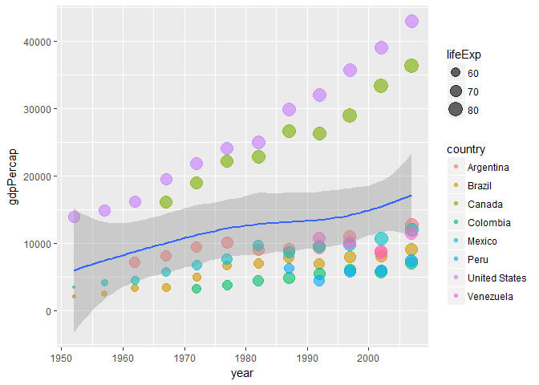

Homework 02: Explore Gapminder and use dplyr
================

## Setting ups

Before doing anything exciting with `gapminder` and `dplyr`, first we
should get the packages installed and loaded.

``` r
install.packages("gapminder")
install.packages("tidyverse")
library(gapminder)
suppressPackageStartupMessages(library(tidyverse))
```

## Smell test the data

  - Is it a data.frame, a matrix, a vector, a list?

<!-- end list -->

``` r
typeof(gapminder)
```

    ## [1] "list"

It is a data.frame, but when using `typeof`, the output is always base R
type.

  - What is its class?

<!-- end list -->

``` r
class(gapminder)
```

    ## [1] "tbl_df"     "tbl"        "data.frame"

As mentioned above, the class of `gapminder` is data.frame.

  - How many variables/columns?

<!-- end list -->

``` r
ncol(gapminder)
```

    ## [1] 6

  - How many rows/observations?

<!-- end list -->

``` r
nrow(gapminder)
```

    ## [1] 1704

  - Can you get these facts about “extent” or “size” in more than one
    way? Can you imagine different functions being useful in different
    contexts?

<!-- end list -->

``` r
dim(gapminder)
```

    ## [1] 1704    6

``` r
str(gapminder)
```

    ## Classes 'tbl_df', 'tbl' and 'data.frame':    1704 obs. of  6 variables:
    ##  $ country  : Factor w/ 142 levels "Afghanistan",..: 1 1 1 1 1 1 1 1 1 1 ...
    ##  $ continent: Factor w/ 5 levels "Africa","Americas",..: 3 3 3 3 3 3 3 3 3 3 ...
    ##  $ year     : int  1952 1957 1962 1967 1972 1977 1982 1987 1992 1997 ...
    ##  $ lifeExp  : num  28.8 30.3 32 34 36.1 ...
    ##  $ pop      : int  8425333 9240934 10267083 11537966 13079460 14880372 12881816 13867957 16317921 22227415 ...
    ##  $ gdpPercap: num  779 821 853 836 740 ...

  - What data type is each variable?

<!-- end list -->

``` r
head(gapminder)
```

    ## # A tibble: 6 x 6
    ##   country     continent  year lifeExp      pop gdpPercap
    ##   <fctr>      <fctr>    <int>   <dbl>    <int>     <dbl>
    ## 1 Afghanistan Asia       1952    28.8  8425333       779
    ## 2 Afghanistan Asia       1957    30.3  9240934       821
    ## 3 Afghanistan Asia       1962    32.0 10267083       853
    ## 4 Afghanistan Asia       1967    34.0 11537966       836
    ## 5 Afghanistan Asia       1972    36.1 13079460       740
    ## 6 Afghanistan Asia       1977    38.4 14880372       786

We can find the data types in the row below the variable names.

## Explore individual variables

  - What are possible values (or range, whichever is appropriate) of
    each variable?

<!-- end list -->

``` r
summary(gapminder $ continent)
```

    ##   Africa Americas     Asia   Europe  Oceania 
    ##      624      300      396      360       24

``` r
summary(gapminder $ pop)
```

    ##      Min.   1st Qu.    Median      Mean   3rd Qu.      Max. 
    ## 6.001e+04 2.794e+06 7.024e+06 2.960e+07 1.959e+07 1.319e+09

  - What values are typical? What’s the spread? What’s the distribution?
    Etc., tailored to the variable at hand.

`summary` function can show us many things mentioned above, or we can
check the distribution of the data by bar plot.

``` r
gapminder %>% 
  ggplot(aes(x = pop)) + geom_histogram(bins = 100) + scale_x_log10()
```

<!-- -->

## Explore various plot types

  - A scatterplot of two quantitative variables.

<!-- end list -->

``` r
gapminder %>% 
  ggplot(aes(x = gdpPercap, y = lifeExp, color = continent, size = year)) + geom_point(alpha = 0.5) + scale_x_log10()
```

<!-- -->

  - A plot of one quantitative variable. Maybe a histogram or
    densityplot or frequency polygon.

<!-- end list -->

``` r
gapminder %>% 
  ggplot(aes(x = lifeExp)) + geom_density()
```

<!-- -->

  - A plot of one quantitative variable and one categorical. Maybe
    boxplots for several continents or countries.

<!-- end list -->

``` r
gapminder %>% 
  ggplot(aes(x = continent, y = lifeExp, color = year, size = pop)) + geom_violin() + geom_jitter()
```

<!-- -->

## Use `filter()`, `select()` and `%>%`

With `filter` function we can create a data subset and do some
exploration.

``` r
gapminder %>% 
  filter(continent == "Americas" & pop > 1e7) %>% 
  ggplot(aes(x = year, y = lifeExp, color = country)) + geom_point(aes(size = pop), alpha=0.6) + geom_line()
```

<!-- -->

## But I want to do more\!

  - The correct form of boolean expression

<!-- end list -->

``` r
filter(gapminder, country == c("Rwanda", "Afghanistan"))
```

    ## # A tibble: 12 x 6
    ##    country     continent  year lifeExp      pop gdpPercap
    ##    <fctr>      <fctr>    <int>   <dbl>    <int>     <dbl>
    ##  1 Afghanistan Asia       1957    30.3  9240934       821
    ##  2 Afghanistan Asia       1967    34.0 11537966       836
    ##  3 Afghanistan Asia       1977    38.4 14880372       786
    ##  4 Afghanistan Asia       1987    40.8 13867957       852
    ##  5 Afghanistan Asia       1997    41.8 22227415       635
    ##  6 Afghanistan Asia       2007    43.8 31889923       975
    ##  7 Rwanda      Africa     1952    40.0  2534927       493
    ##  8 Rwanda      Africa     1962    43.0  3051242       597
    ##  9 Rwanda      Africa     1972    44.6  3992121       591
    ## 10 Rwanda      Africa     1982    46.2  5507565       882
    ## 11 Rwanda      Africa     1992    23.6  7290203       737
    ## 12 Rwanda      Africa     2002    43.4  7852401       786

The right way is using `%in%` expression here.

``` r
filter(gapminder, country %in% c("Rwanda", "Afghanistan"))
```

    ## # A tibble: 24 x 6
    ##    country     continent  year lifeExp      pop gdpPercap
    ##    <fctr>      <fctr>    <int>   <dbl>    <int>     <dbl>
    ##  1 Afghanistan Asia       1952    28.8  8425333       779
    ##  2 Afghanistan Asia       1957    30.3  9240934       821
    ##  3 Afghanistan Asia       1962    32.0 10267083       853
    ##  4 Afghanistan Asia       1967    34.0 11537966       836
    ##  5 Afghanistan Asia       1972    36.1 13079460       740
    ##  6 Afghanistan Asia       1977    38.4 14880372       786
    ##  7 Afghanistan Asia       1982    39.9 12881816       978
    ##  8 Afghanistan Asia       1987    40.8 13867957       852
    ##  9 Afghanistan Asia       1992    41.7 16317921       649
    ## 10 Afghanistan Asia       1997    41.8 22227415       635
    ## # ... with 14 more rows

  - Use `knitr::kable` to present numerical tables in a more attractive
    form.

<!-- end list -->

``` r
knitr::kable(filter(gapminder, continent %in% c("Asia", "Americas") & year == 2002 & pop > 3e7))
```

| country       | continent | year | lifeExp |        pop | gdpPercap |
| :------------ | :-------- | ---: | ------: | ---------: | --------: |
| Argentina     | Americas  | 2002 |  74.340 |   38331121 |  8797.641 |
| Bangladesh    | Asia      | 2002 |  62.013 |  135656790 |  1136.390 |
| Brazil        | Americas  | 2002 |  71.006 |  179914212 |  8131.213 |
| Canada        | Americas  | 2002 |  79.770 |   31902268 | 33328.965 |
| China         | Asia      | 2002 |  72.028 | 1280400000 |  3119.281 |
| Colombia      | Americas  | 2002 |  71.682 |   41008227 |  5755.260 |
| India         | Asia      | 2002 |  62.879 | 1034172547 |  1746.769 |
| Indonesia     | Asia      | 2002 |  68.588 |  211060000 |  2873.913 |
| Iran          | Asia      | 2002 |  69.451 |   66907826 |  9240.762 |
| Japan         | Asia      | 2002 |  82.000 |  127065841 | 28604.592 |
| Korea, Rep.   | Asia      | 2002 |  77.045 |   47969150 | 19233.988 |
| Mexico        | Americas  | 2002 |  74.902 |  102479927 | 10742.441 |
| Myanmar       | Asia      | 2002 |  59.908 |   45598081 |   611.000 |
| Pakistan      | Asia      | 2002 |  63.610 |  153403524 |  2092.712 |
| Philippines   | Asia      | 2002 |  70.303 |   82995088 |  2650.921 |
| Thailand      | Asia      | 2002 |  68.564 |   62806748 |  5913.188 |
| United States | Americas  | 2002 |  77.310 |  287675526 | 39097.100 |
| Vietnam       | Asia      | 2002 |  73.017 |   80908147 |  1764.457 |

  - More explorations about `dplyr`

<!-- end list -->

``` r
gapminder %>% 
  filter(continent == "Americas" & pop > 2e7) %>% 
  ggplot(aes(x = year, y = gdpPercap)) + geom_point(aes(color = country, size = lifeExp), alpha = 0.6) + geom_smooth()
```

    ## `geom_smooth()` using method = 'loess'

<!-- -->
